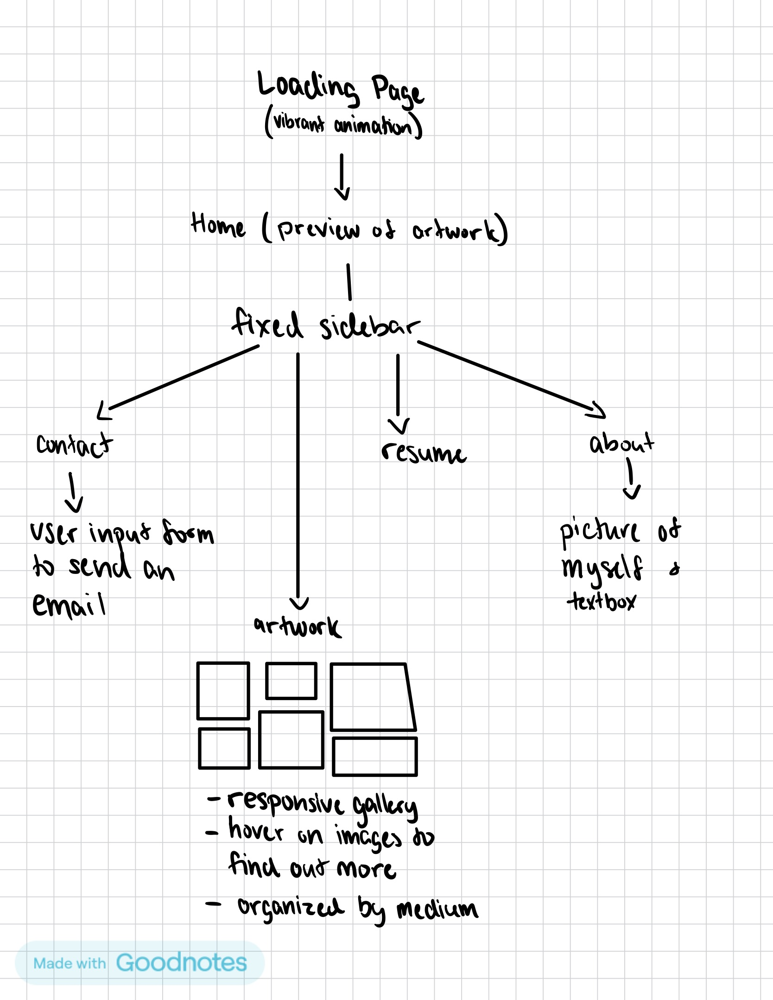

# Web Dev Final Outline

## Concept / Theme
For my final, I will be expanding and improving the design portfolio website I made for my midterm. The final product of my midterm set a proper framework for UX, as the user could easily navigate through different artworks, background information,  the contact page and resume page. Now that I have more experience with different HTML, CSS and JavaScript functions, I would like to enhance the UX and visual aesthetic of the site to better reflect my personal artistic expression. Much of my artwork is vibrant, expressive and colourful. I see a portfolio website as a less obvious form of artwork that the artist is presenting when people visit it, as it exhibits the artist's use of different design elements. Thus, I would like to include more user interaction with the site such as an animated loading page, an animated logo, and more affordability/feedback from every button and linked item.

## Visual & UX Inspiration

### Websites 
* https://www.sliderrevolution.com/templates/furniture-store-isometric-slider/?utm_medium=inline-ad&utm_source=cool-javascript-animations

### Specific UX tools
* Loading page 
https://www.sliderrevolution.com/design/cool-javascript-animations/ 
* Underline hover  
https://webflow.com/made-in-webflow/website/20-Link-Effects
* Reshape hover  
https://webflow.com/made-in-webflow/website/vibrand-css-button-hover-styles 

### Font options
* Apple Garamond https://www.dafont.com/apple-garamond.font
* Relationship of Melodrame https://www.dafont.com/relationship-of-melodrame.font
* Miligant https://www.dafont.com/miligant.font 
* Roughly Begather https://www.dafont.com/roughly-begather.font
* Eye Quirky https://www.dafont.com/eye-quirky.font 

## HTML/CSS/JS Skills You Plan to Use
- buttons - with js animation and transforamtions
- classes - for artworks, titles, dimentions and descriptions
- user input forms - contact page
- gallery + flex properties
- create js objects 

## Wireframe or Sitemap
