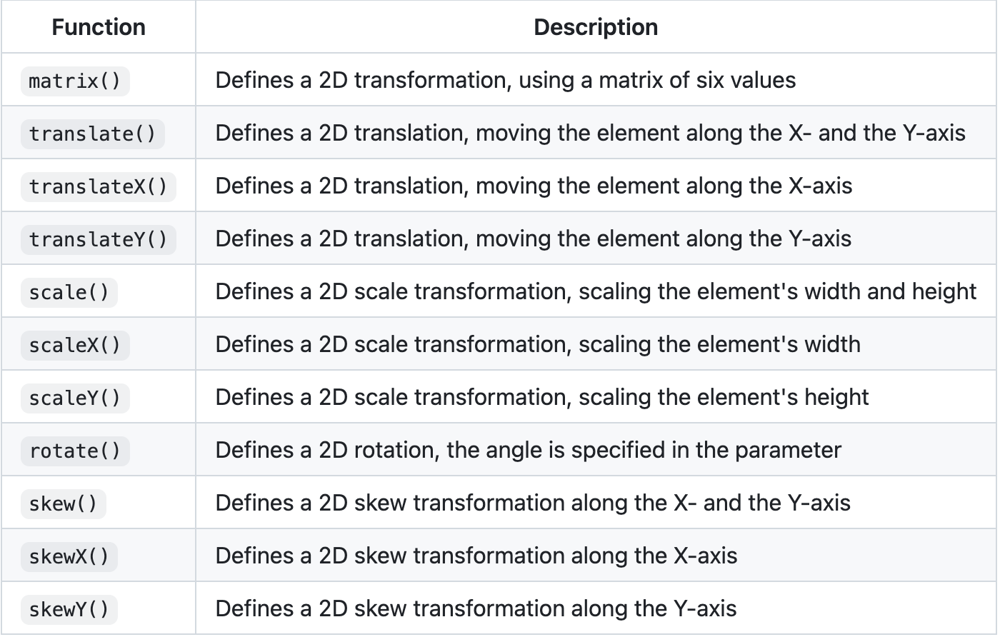
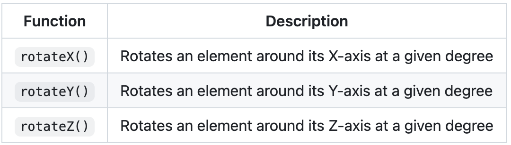
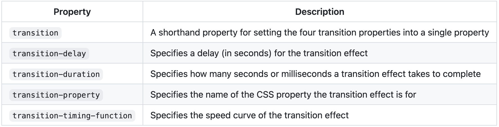

March 4 Notes

# DIV

### HTML Div Element

The ```<div>``` element is used as a container for other HTML elements.

The ```<div>``` element is by default a block element, meaning that it takes all available width, and comes with line breaks before and after.

A ```<div>``` element takes up all available width:
```
<p>Lorem Ipsum <div>I am a div</div> dolor sit amet.</p>
```
The ```<div>``` element has no required attributes, but style, class and id are common.

### Float
Example:
```
.mycontainer {
  width: 100%;
  overflow: auto;
}
.mycontainer div {
  width: 33%;
  float: left;
}
```

### Inline-block
Example:
```
div {
  width: 30%;
  display: inline-block;
}
```
### Flex
Example:
```
.mycontainer {
  display: flex;
}
.mycontainer > div {
  width: 33%;
}
```
### Grid
Example:
```
.grid-container {
  display: grid;
  grid-template-columns: 33% 33% 33%;
}
```
---

# Classes
Classes allow you to communicate with a class name within a style sheet

In the following example we have three ```<div>``` elements with a class attribute with the value of "city". All of the three ```<div>``` elements will be styled equally according to the .city style definition in the head section:
[Example](http://127.0.0.1:3002/Week7/ClassNotes/Classes.html)

# Image Sizing
Cover: The image will fit and resize to the box you made

Contain: The image will fit in the box yet will not change its ratio of dimentions

Border property: can be used to make a thumbnail
- use a border radius
- you can wrap the border in an anchor to make it a link
  - to make a link open a new window: ```target="blank"```

  Opacity: to change opacity of an image
  - create a class
  ``` 
  .opacity {
    opacity: 0.5
  }


  Position of text: can be varied in different classes

  
  .textCenter {
  position: absolute;
  top: 50%;
  left: 50%;
  transform: translate(-50%, -50%);
  font-size: 18px;
}

.topleft {
  position: absolute;
  top: 8px;
  left: 12px;
  font-size: 20px;
}

.topright {
  position: absolute;
  top: 8px;
  right: 12px;
  font-size: 20px;
}

.bottomleft {
  position: absolute;
  bottom: 8px;
  left: 12px;
  font-size: 20px;
}

.bottomright {
  position: absolute;
  bottom: 8px;
  right: 12px;
  font-size: 20px;
}

# Image Styling
Overlay: could be during a hover effect, the opacity will change
```
.overlay {
  position: absolute;
  top: 0;
  bottom: 0;
  left: 0;
  right: 0;
  height: 100%;
  width: 100%;
  opacity: 0;
  transition: 0.5s ease;
  background-color: black;
}

.container:hover .overlay {
  opacity: 1;
}

.text {
  color: white;
  font-size: 20px;
  position: absolute;
  top: 50%;
  left: 50%;
  transform: translate(-50%, -50%);
  -ms-transform: translate(-50%, -50%);
}
```
# Transforms and Transitions

### CSS 2D Transforms


### CSS 3D Transforms


### CSS 3D Transitions

