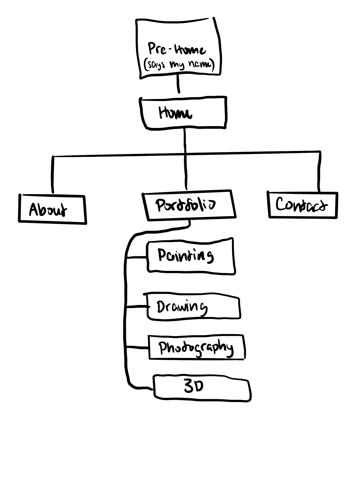

# Midterm Proposal
## Idea
The website I will create for my midterm will showcase my **design portfolio**, highlighting all of my artworks and design projects. 

Based off portfolio websites I have seen, I believe I should include 4 sections: "Home", "Portfolio", "About" and "Contact". 

Since the website is showcasing my artistic skills, it must fit unifyingly with the style of my artworks. I feel that they are very colorful and vibrant for the most part. 

*Currently this is what my portfolio looks like: https://gemmatos12.wixsite.com/gemmaliangportfolio*

## Inspiration Websites
1. [Jonathan Chen Portfolio](https://jonnychen.wixsite.com/jonathanchenart)
    - This portfolio showcases the artist's according to the year it was made and (some not all) the series it is apart of
2. [Tina Boroviak Portfolio](https://www.tinaboroviak.com/)
    - This website organizes the artworks based on the medium 
        - I like this style for mine since mine includes a large range of mediums

## HTML and CSS Skills I Will Use From Class
- Gallery
- Box Models
- Navigation Bar 
- Div styling 

## HTML and CSS Skills I Will Need to Learn
- Hover tools - to make the UX better by implying what parts of the website lead to a new page
    - images slightly increase 
    - title of artwork is shown + darkened filter over image of artwork
- Page Transitions without clicking

## Sitemap
